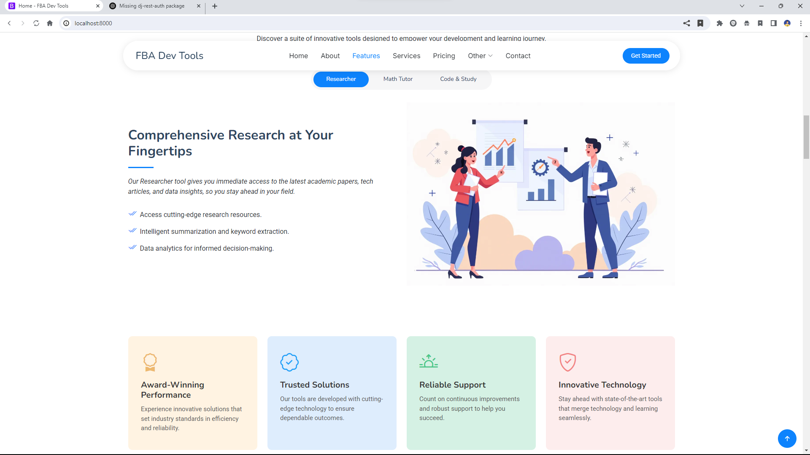

Below is an example of a comprehensive README.md file that explains installation, testing, features, and production setup:

---

# AI Assistant Django Tools

A Django-based project that integrates multiple AI-powered tools into a single platform. The project includes the following features:

- **Code Optimiser:** Analyze and optimize Python code with detailed explanations and unit test generation.
- **Study Planner:** Generate detailed study schedules based on exam dates and subjects, with outputs in an organized table and downloadable PDF.
- **Math Tutor:** Solve math problems and generate worksheets with interactive chat-style conversation.
- **Researcher:** Analyze research papers by accepting text or file attachments (PDF/DOC) and returning concise, fact-based responses.

## Features

- **Multiple Tools in One Platform:** Use Code Optimiser, Study Planner, Math Tutor, and Researcher—all within the same Django application.
- **Session Management:** Each tool stores conversation history in user-specific sessions with options to create, load, and download session outputs.
- **Responsive, Chat-Style Interface:** Built with Bootstrap, providing a modern and responsive design.
- **File Attachment Support:** For the Researcher tool, users can attach PDF or DOC files to ask questions based on research papers.
- **PDF Download Options:** Easily download study planner and worksheet outputs as PDF files.
- **Gemini API Integration:** Utilizes Google’s Gemini API (or similar generative model API) to power responses.

## Demo 

- **Video**  
[](https://www.youtube.com/watch?v=bXgr1dg1nJU)

- **Images**  

|  |  |  |
|---|---|---|
|  |  |  |
|  |  |  |
|  |  |  |
|  |  |  |
|  |  |  |
|  |  |  |


## Installation

### Prerequisites

- Python 3.11 or higher
- Git
- Virtualenv (or any virtual environment manager)

### Steps

1. **Clone the Repository**

   ```bash
   git clone https://github.com/YadavIshant0808/fbaaitools.git
   cd fbaaitools
   ```

2. **Create and Activate a Virtual Environment**

   ```bash
   python -m venv venv
   # On Windows:
   .venv\Scripts\activate
   # On macOS/Linux:
   source venv/bin/activate
   ```

3. **Install Dependencies**

   Make sure you have a `requirements.txt` file in the repository. Then run:

   ```bash
   pip install -r requirements.txt
   pip install "django-allauth[socialaccount]"
   ```


4. **Create a `.env` File**

   In the root directory of the project, create a file named `.env` and add your environment variables. For example:

   ```env
   DEBUG=True
   SECRET_KEY=your_secret_key_here
   ALLOWED_HOSTS=localhost,127.0.0.1
   GEMINI_API_KEY=your_gemini_api_key_here
   DATABASE_URL=sqlite:///db.sqlite3
   ```

5. **Database Setup**

   If you prefer not to create the database from scratch, you can download a pre-built database from [this Google Drive link](https://drive.google.com/drive/folders/1zWyf49yBiguVZtE3WrJ6xcujtMpbZ7pD?usp=sharing). Place the downloaded database file in the appropriate location (e.g., replace `db.sqlite3` in your project root).

   Otherwise, run:

   ```bash
   python manage.py makemigrations
   python manage.py migrate
   ```

6. **Collect Static Files**

   (For production or if needed in testing)

   ```bash
   python manage.py collectstatic
   ```

7. **Run the Development Server**

   ```bash
   python manage.py runserver
   ```

   Now visit [http://localhost:8000](http://localhost:8000) to test the application.

## Testing

- Ensure your virtual environment is active.
- Run the development server with `python manage.py runserver`.
- Interact with each tool:
  - For **Code Optimiser**, paste your code snippet and click the send icon.
  - For **Study Planner**, enter subjects and exam dates, then generate a timetable.
  - For **Math Tutor**, switch between the "Solve" and "Worksheet" tabs.
  - For **Researcher**, attach a research paper (PDF/DOC) or paste text and submit your query.
- Watch the loading indicators when you click send as the system processes your request.

## Production Setup

1. **Environment Variables:**  
   Set `DEBUG=False` and update `ALLOWED_HOSTS` with your production domain names. Secure your `SECRET_KEY` and any API keys in your environment.

2. **Static Files:**  
   Run `python manage.py collectstatic` to gather all static files. Configure your web server (e.g., Nginx) to serve these files.

3. **Database:**  
   For production, consider using a more robust database like PostgreSQL. Update your `DATABASE_URL` in the `.env` file accordingly.

4. **WSGI Server:**  
   Use a production-grade WSGI server like Gunicorn. For example:

   ```bash
   gunicorn yourprojectname.wsgi:application --bind 0.0.0.0:8000
   ```

5. **HTTPS:**  
   Configure your server to use HTTPS (via a reverse proxy like Nginx and Let’s Encrypt).

6. **Logging & Monitoring:**  
   Set up logging and monitoring to track errors and performance in production.

7. **Security:**  
   Ensure you follow Django’s deployment checklist:
   - Use strong passwords and update dependencies regularly.
   - Consider using Django Security Middleware and Content Security Policy (CSP).

## Additional Information

- **API Integration:**  
  The project uses Google’s Gemini API for generative responses. Ensure your API key is valid and you comply with the API usage guidelines.

- **Contributions:**  
  Contributions and improvements are welcome. Please fork the repository and create a pull request with your changes.

- **License:**  
  This project is licensed under the MIT License.

---

This README should help new users install, test, and deploy the project. Adjust URLs, project names, and other specifics as needed for your environment.